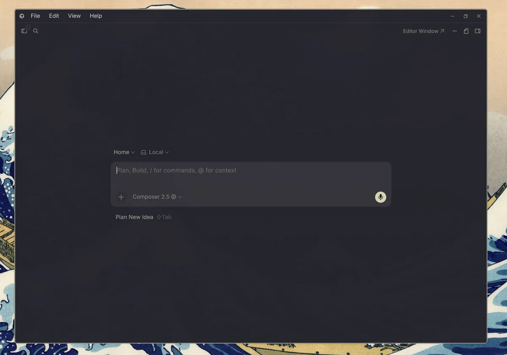
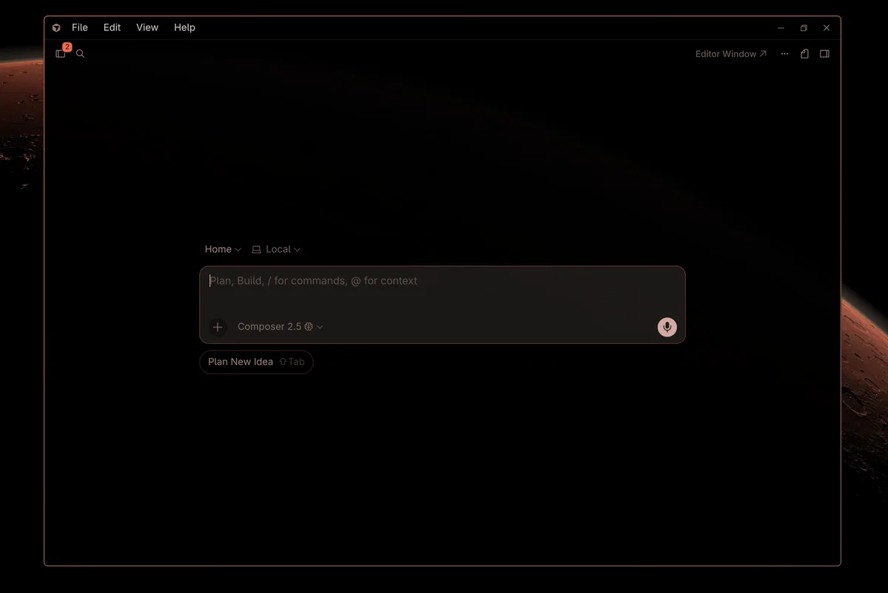
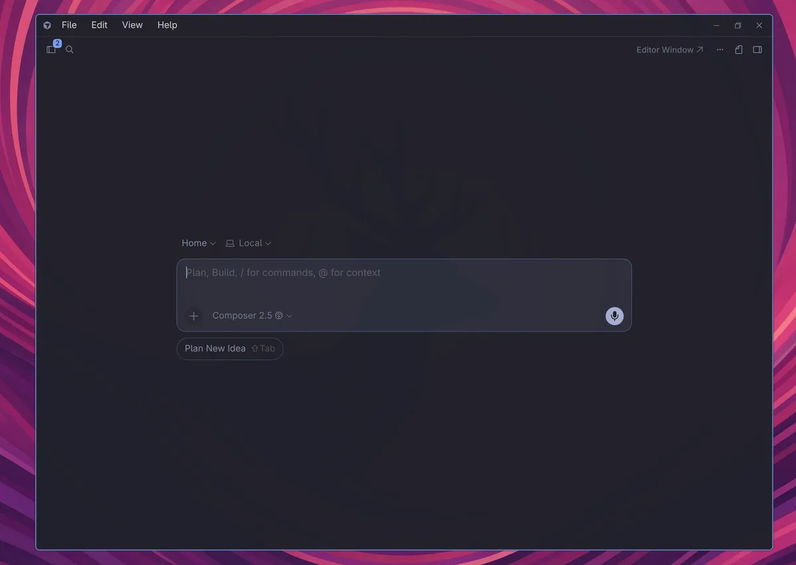
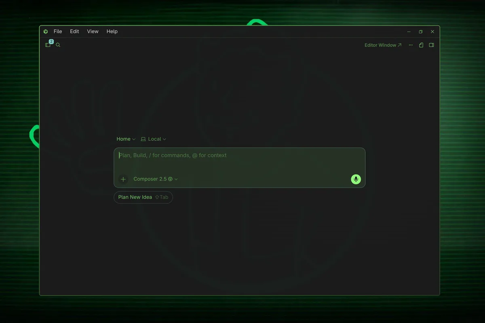
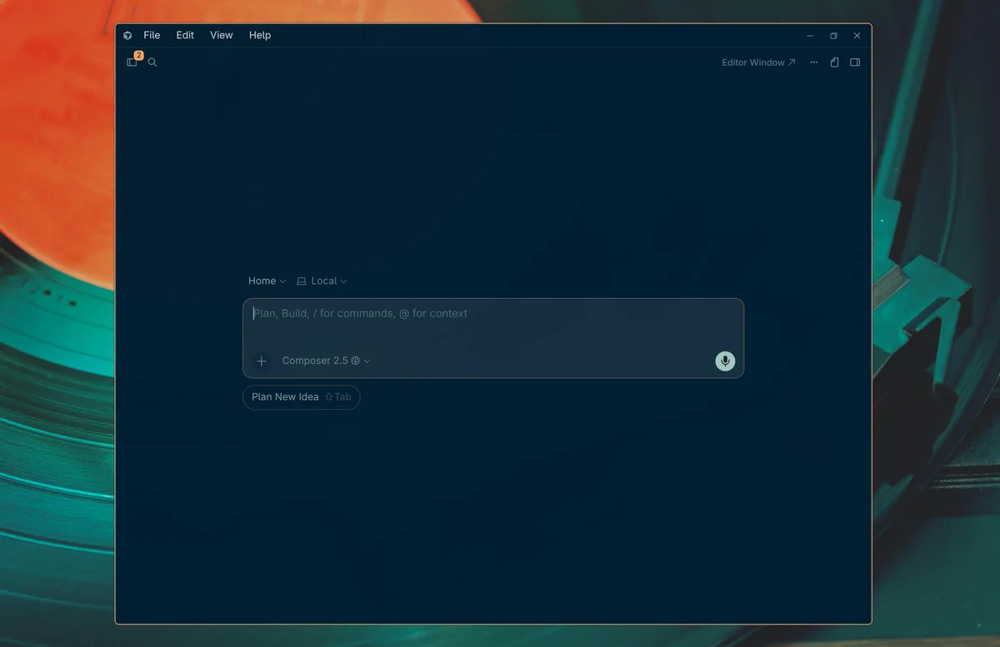
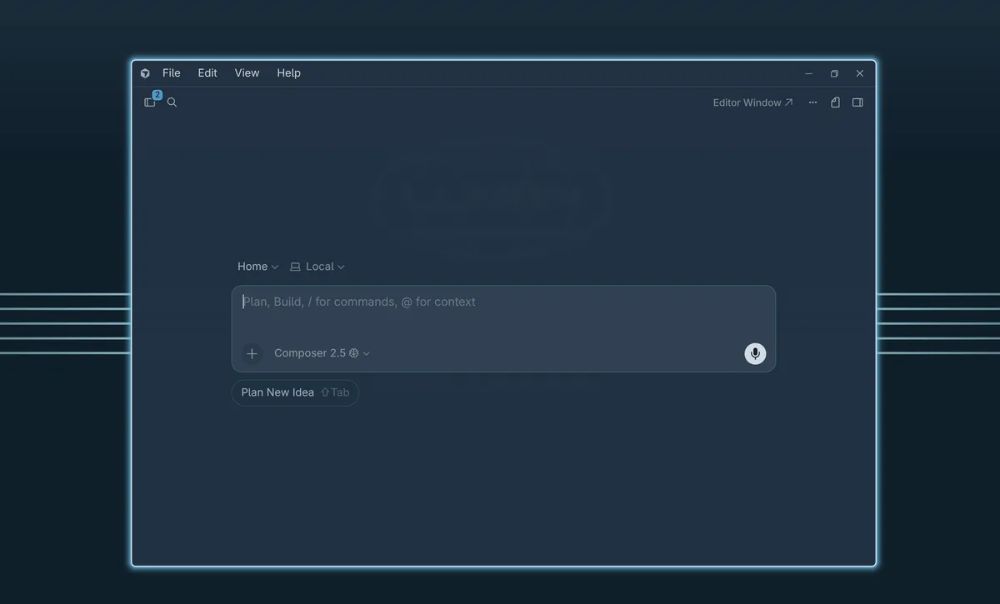
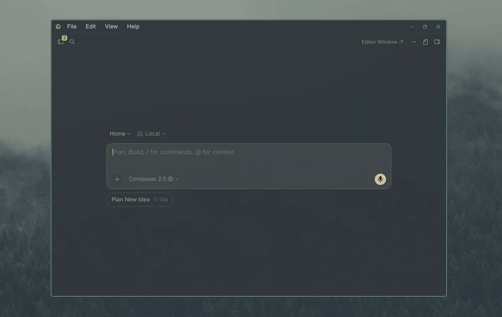

# Cursor Omarchy Agent Theme

A small tool that makes Cursor's new **Agents / Glass** UI follow your active Omarchy theme.

## Screenshots

<table>
  <tr>
    <td></td>
    <td></td>
  </tr>
  <tr>
    <td></td>
    <td></td>
  </tr>
  <tr>
    <td></td>
    <td></td>
  </tr>
  <tr>
    <td></td>
    <td></td>
  </tr>
</table>

## Why

Cursor Agents uses Cursor's newer **Glass** UI. It does **not** meaningfully follow normal VS Code/Cursor editor themes, so changing `workbench.colorTheme` or installing VS Code themes does not theme the Agent app.

Omarchy already has great system-wide themes. This tool makes the **Cursor Agents app** match the active Omarchy theme by generating Glass-specific CSS from the Omarchy palette.

This is intentionally focused on **Cursor Agents only**. It does not try to theme the Cursor editor.

## Important warning

This direct-patches Cursor's installed CSS bundle:

```text
/usr/share/cursor/resources/app/out/vs/workbench/workbench.desktop.main.css
```

That is currently the only path we've found that reliably affects the Cursor Agents / Glass UI. Because this modifies an installed Cursor file, the Cursor editor may show a warning that the installation appears corrupt while the patch is installed.

You can restore Cursor's original CSS at any time:

```bash
cursor-omarchy-agent-theme restore
```

Cursor updates may overwrite the patch. Re-run `./install.sh` after Cursor updates.

## Install

```bash
git clone https://github.com/rblalock/omarchy-cursor-glass-theme.git
cd omarchy-cursor-glass-theme
./install.sh
```

The installer:

1. Installs `~/.local/bin/cursor-omarchy-agent-theme`
2. Backs up Cursor's CSS bundle
3. Grants your user write access to that one CSS file with `setfacl` so Omarchy theme hooks can update it without sudo
4. Applies the current Omarchy theme to Cursor Agents
5. Adds an Omarchy `theme-set` hook

After install, fully quit and relaunch Cursor Agents.

## Usage

Apply the current Omarchy theme:

```bash
cursor-omarchy-agent-theme apply
```

Apply a specific Omarchy theme:

```bash
cursor-omarchy-agent-theme apply Kanagawa
cursor-omarchy-agent-theme apply "Rose Pine Dark"
```

Check status:

```bash
cursor-omarchy-agent-theme status
```

Restore Cursor's original CSS:

```bash
cursor-omarchy-agent-theme restore
```

After `apply` or `restore`, fully quit and relaunch Cursor Agents to see changes.

## Automatic Omarchy theme sync

The installer adds this to:

```text
~/.config/omarchy/hooks/theme-set
```

```bash
# >>> cursor-omarchy-agent-theme hook >>>
# Sync Cursor Agents Glass theme to Omarchy.
if [ -x "$HOME/.local/bin/cursor-omarchy-agent-theme" ]; then
  "$HOME/.local/bin/cursor-omarchy-agent-theme" apply "$1" || true
elif command -v cursor-omarchy-agent-theme >/dev/null 2>&1; then
  cursor-omarchy-agent-theme apply "$1" || true
fi
# <<< cursor-omarchy-agent-theme hook <<<
```

So when you run:

```bash
omarchy theme set Kanagawa
```

Cursor Agents CSS is patched for that theme. Relaunch Cursor Agents to pick it up.

## Theme support

This is not hardcoded to Kanagawa. It supports any Omarchy theme under:

```text
~/.config/omarchy/themes/<theme>
~/.local/share/omarchy/themes/<theme>
```

Palette priority:

1. `vscode.json` with inline `colors`
2. Installed VS Code/Cursor extension referenced by `vscode.json` (`extension` + `name`), searched in:
   ```text
   ~/.cursor/extensions
   ~/.vscode/extensions
   ```
3. `colors.toml`
4. Fallback colors found in `waybar.css` and `hyprland.conf`
5. Built-in defaults

Many Omarchy themes include a `vscode.json`, but most reference an external theme extension rather than embedding colors directly. If that extension is installed, this tool reads its theme JSON first. Otherwise it falls back to Omarchy's own palette files.

Best fallback results come from themes with a `colors.toml` containing keys like:

```toml
background = "#1f1f28"
foreground = "#dcd7ba"
accent = "#7e9cd8"
selection_background = "#2d4f67"
selection_foreground = "#c8c093"
color0 = "#090618"
color1 = "#c34043"
# ... color2 through color15
```

## How it works

The generated CSS targets Cursor's Glass UI selectors:

```css
body[data-cursor-glass-mode="true"]
body[data-cursor-glass-mode="true"] [data-component="agent-panel"]
body[data-cursor-glass-mode="true"] .composer-messages-container
body[data-cursor-glass-mode="true"] .ui-prompt-input__container
body[data-cursor-glass-mode="true"] .composer-human-message.standalone-glass
```

The patch is inserted between clear markers and replaced on each theme change:

```css
/* >>> cursor-omarchy-agent-theme >>> */
...
/* <<< cursor-omarchy-agent-theme <<< */
```

The original file is backed up to:

```text
/usr/share/cursor/resources/app/out/vs/workbench/workbench.desktop.main.css.bak.cursor-omarchy-agent-theme
```

## Troubleshooting

### `cursor-omarchy-agent-theme: command not found`

Use the full path:

```bash
~/.local/bin/cursor-omarchy-agent-theme status
```

or add `~/.local/bin` to your `PATH`.

### Theme changed but Cursor Agents did not

Fully quit and relaunch Cursor Agents. The CSS is read when Cursor starts.

Also check:

```bash
cursor-omarchy-agent-theme status
```

You want:

```text
Patch installed: yes
Omarchy hook: yes
Writable by current user: yes
```

### Cursor updated and theming disappeared

Re-run:

```bash
./install.sh
```

## Uninstall

Restore Cursor's CSS:

```bash
cursor-omarchy-agent-theme restore
```

Remove the script:

```bash
rm -f ~/.local/bin/cursor-omarchy-agent-theme
```
